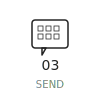

  <picture>
    <source media="(prefers-color-scheme: dark)" srcset="./assets/minimalist-header-dark-v4.svg">
    <source media="(prefers-color-scheme: light)" srcset="./assets/minimalist-header-v4.svg">
    
  </picture>

 

  <picture>
    <source media="(prefers-color-scheme: dark)" srcset="./assets/divider-dark.svg">
    <source media="(prefers-color-scheme: light)" srcset="./assets/divider.svg">
    
  </picture>

 

<h2 align="center">Send an Encrypted Message</h2>

<h3 align="center">To <em>send</em> an encrypted message, all you need is <em>my</em> public PGP key...</h3>

  <a href="https://github.com/hesreallyhim.gpg">
    <picture>
      <source media="(prefers-color-scheme: dark)" srcset="./assets/step-01-getkey-dark.svg">
      <source media="(prefers-color-scheme: light)" srcset="./assets/step-01-getkey.svg">
      
    </picture>
  </a>
  <picture>
    <source media="(prefers-color-scheme: dark)" srcset="./assets/step-arrow-dark.svg">
    <source media="(prefers-color-scheme: light)" srcset="./assets/step-arrow.svg">
    
  </picture>
  <a href="https://hesreallyhim.github.io/my-pgp-inbox/">
    <picture>
      <source media="(prefers-color-scheme: dark)" srcset="./assets/step-02-encrypt-dark.svg">
      <source media="(prefers-color-scheme: light)" srcset="./assets/step-02-encrypt.svg">
      
    </picture>
  </a>
  <picture>
    <source media="(prefers-color-scheme: dark)" srcset="./assets/step-arrow-dark.svg">
    <source media="(prefers-color-scheme: light)" srcset="./assets/step-arrow.svg">
    
  </picture>
  <a href="https://github.com/hesreallyhim/my-pgp-inbox/issues/new">
    <picture>
      <source media="(prefers-color-scheme: dark)" srcset="./assets/step-03-send-dark.svg">
      <source media="(prefers-color-scheme: light)" srcset="./assets/step-03-send.svg">
      
    </picture>
  </a>

<h3 align="center">If you want my <em>reply</em> to be encrypted, all you need is to share <em>your</em> public PGP key...</h3>

<table align="center">
<tr>
<td width="200"><b>Public Key</b></td>
<td>Lets others send messages that only <em>you</em> can read</td>
</tr>
<tr>
<td><b>Private Key</b></td>
<td>Lets <em>you</em> read messages that no one <em>else</em> can read</td>
</tr>
</table>

 

## Isn't that ***amazing?***

### The crazy thing is: ***no one even knows how it works!***[^1]

### **Want to know more?** See the [setup guide](./docs/QUICKSTART.md) — it only takes about 5 minutes.

### **In a hurry?** You can visit [this page](https://hesreallyhim.github.io/my-pgp-inbox/) to create an encryped message right from your browser.

 

  <picture>
    <source media="(prefers-color-scheme: dark)" srcset="./assets/divider-dark.svg">
    <source media="(prefers-color-scheme: light)" srcset="./assets/divider.svg">
    
  </picture>

<h3 align="center">
<i>"Cryptography is the ultimate form of non-violent direct action."</i>
</h3>

  <picture>
    <source media="(prefers-color-scheme: dark)" srcset="./assets/footer-lock-dark.svg">
    <source media="(prefers-color-scheme: light)" srcset="./assets/footer-lock.svg">
    
  </picture>

 

## Why PGP?

 

<table align="center">
<tr>
<td width="200"><b>End-to-end encryption</b></td>
<td>Only I can read your message</td>
</tr>
<tr>
<td><b>Mathematically secure</b></td>
<td>No backdoors, no exceptions (not even GitHub)</td>
</tr>
<tr>
<td><b>Verified identity</b></td>
<td>My key, my identity</td>
</tr>
</table>

 

  <picture>
    <source media="(prefers-color-scheme: dark)" srcset="./assets/divider-dark.svg">
    <source media="(prefers-color-scheme: light)" srcset="./assets/divider.svg">
    
  </picture>

 

>[!Warn]
>PGP encryption is very strong - it is used by journalists, activists, and security professionals all over the world. However, this particular repo is **not** an appropriate platform for sending highly sensitive information, and it's not designed with that purpose in mind. 

 

  <picture>
    <source media="(prefers-color-scheme: dark)" srcset="./assets/divider-dark.svg">
    <source media="(prefers-color-scheme: light)" srcset="./assets/divider.svg">
    
  </picture>

<h3 align="center">
<i>"Strong cryptography can resist an unlimited application of violence.

No amount of coercive force will ever solve a math problem."</i>
</h3>

  <picture>
    <source media="(prefers-color-scheme: dark)" srcset="./assets/footer-lock-dark.svg">
    <source media="(prefers-color-scheme: light)" srcset="./assets/footer-lock.svg">
    
  </picture>

## Licenses

See [LICENSE](./LICENSE) for license information.

[^*]: That's not true.  
